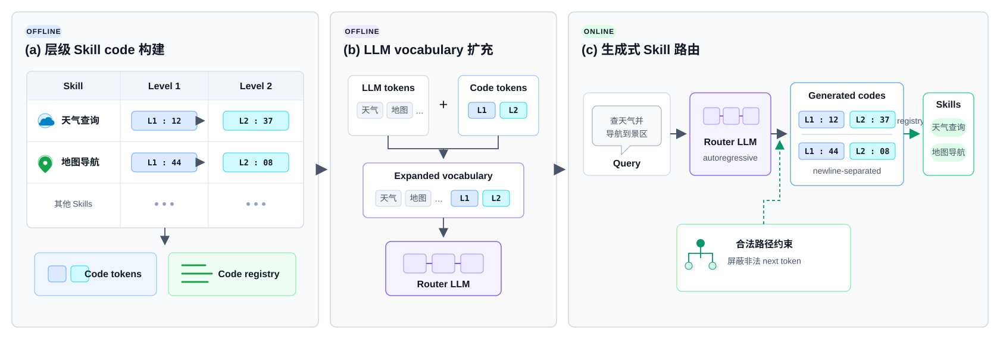
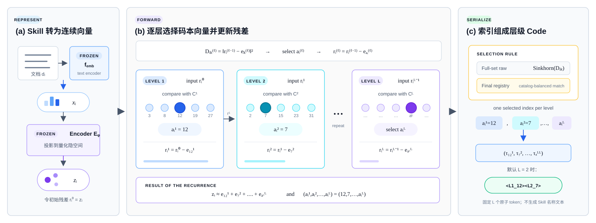
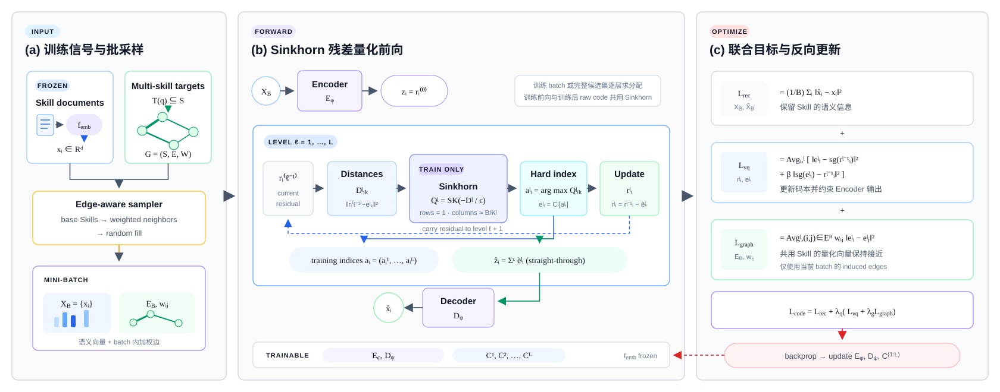
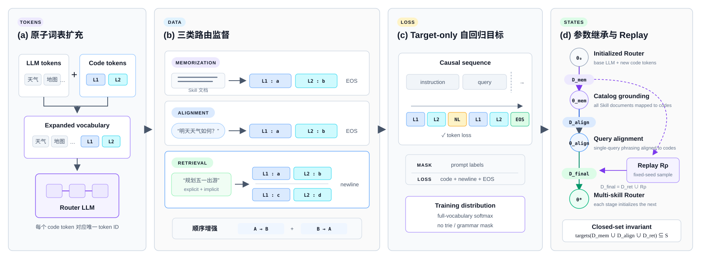
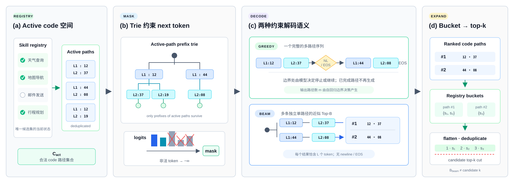

# LLMGen：层级生成式 Agent Skill 路由算法

本文给出 LLMGen 当前训练与推理算法的完整定义。目标是在固定候选集合中，根据用户请求选择一个或多个 Agent Skill，并将语言模型的输出控制在很短的 token 序列内。

本文只讨论算法，不涉及数据存储格式、训练脚本、分布式系统、硬件配置或服务部署。

## 1. 问题定义

给定候选 Agent Skill 集合

```math
\mathcal S=\{s_i\}_{i=1}^{N},
```

其中每个 Skill $s_i$ 具有名称、能力说明和完整文档。对于用户请求
$q$，目标是从 $\mathcal S$ 中选择完成该请求所需的一个或多个 Skill：

```math
\mathcal T(q)\subseteq\mathcal S,
\qquad
m_q=|\mathcal T(q)|,
\qquad
1\le m_q\le N.
```

路由算法学习映射 $F:q\mapsto\widehat{\mathcal T}(q)$，使预测集合
$\widehat{\mathcal T}(q)\subseteq\mathcal S$ 尽可能接近真实目标集合
$\mathcal T(q)$。目标既包括 query 直接表达的能力，也包括未被明确提及、但完成用户任务所必需的能力。

本文采用闭集设定：训练、验证、测试和推理共享同一个候选集合
$\mathcal S$；不同数据划分只包含不同的用户请求，不对应不同的候选空间。

## 2. 方法总览

LLMGen 将 Skill 选择转换为短层级 code 的条件生成。算法不要求 LLM
输出 Skill 名称，也不在推理时逐一比较全部候选；它先为每个候选
Skill 建立固定 code，将构成 code 的 token 加入 LLM vocabulary，再让
LLM 根据 query 直接生成一个或多个合法 code，最后通过 registry 将
code 还原为 Skill。

第 $\ell$ 层包含 $K_\ell$ 个原子 code token。Skill $s_i$ 的 $L$ 层
code 定义为

```math
\begin{aligned}
c(s_i)
&=
\left(
\tau_{a_i^{(1)}}^{(1)},\ldots,
\tau_{a_i^{(L)}}^{(L)}
\right),
\qquad
a_i^{(\ell)}\in\{0,\ldots,K_\ell-1\},
\\
\mathcal V_{\mathrm{code}}
&=
\mathop{\biguplus}_{\ell=1}^{L}\mathcal V_\ell,
\qquad
|\mathcal V_{\mathrm{code}}|
=
\sum_{\ell=1}^{L}K_\ell.
\end{aligned}
```

在接收在线请求之前，code 构建器根据候选 Skill 及其共用关系产生
code 词表、Skill-to-code 映射和反向 registry：

```math
(\mathcal V_{\mathrm{code}},c,\mathcal B)
=
\mathrm{CodeBuild}(\mathcal S,\mathcal D_{\mathrm{train}}).
```

这些 code token 是 LLM 的原子 token，而不是由多个普通文本 token
拼出的字符串。设预训练 LLM 的原始 vocabulary 为
$\mathcal V_{\mathrm{LLM}}$，扩充后的 Router vocabulary 为

```math
\mathcal V_{\mathrm{router}}
=
\mathcal V_{\mathrm{LLM}}
\mathbin{\uplus}
\mathcal V_{\mathrm{code}}.
```

LLM 的输入 embedding 矩阵和输出 projection 随 vocabulary 一同扩展，
使模型能够像生成普通 token 一样生成每一层 code token。基于该词表
得到的已训练 Router 记为 $P_{\theta_\star}$；其训练方法在第 3.2 节
单独介绍，不属于本章的执行流程。

在线推理时，给定 query $q$，Router 在当前合法路径集合
$\mathcal C_{\mathrm{act}}$ 的约束下自回归生成 code 路径：

```math
\widehat{\mathbf C}(q)
=
\mathrm{ConstrainedGenerate}
\left(
P_{\theta_\star},q;
\mathcal V_{\mathrm{router}},
\mathcal C_{\mathrm{act}}
\right),
\qquad
\widehat{\mathcal T}(q)
=
\bigcup_{\mathbf c\in\widehat{\mathbf C}(q)}
\mathcal B(\mathbf c).
```

单个 Skill 对应一条长度为 $L$ 的路径；多个 Skill 对应多条以换行符
分隔的路径。例如，模型可以生成

```text
<SK_L1_12><SK_L2_37>
<SK_L1_44><SK_L2_08>
```

再分别解码为“天气查询”和“地图导航”。约束解码在每一步屏蔽无法构成
合法路径的 token，因此生成结果始终可由 $\mathcal B$ 解释。



**图 1：LLMGen 整体算法框架。** 候选 Skill 首先被映射为短层级
code；code token 随后加入 LLM vocabulary；在线阶段，Router 在合法
路径约束下生成一条或多条 code，并通过 registry 还原为 Skill。

层级 code 构建、Router 参数训练和约束生成的具体算法分别见第 3.1、
3.2 和 3.3 节。

## 3. 具体算法介绍

### 3.1 阶段一：层级 Skill code 构建

记 $d_i$ 为 Skill $s_i$ 的完整文档。第 $\ell$ 层具有
$K_\ell$ 个互斥原子 token：

```math
\mathcal V_\ell
=
\left\{
\tau^{(\ell)}_0,\ldots,
\tau^{(\ell)}_{K_\ell-1}
\right\},
\qquad
\ell=1,\ldots,L.
```

不同层使用互不相交的 token 命名空间。Skill $s_i$ 的固定长度 code 定义为

```math
c(s_i)
=
\left(
\tau^{(1)}_{a_i^{(1)}},
\ldots,
\tau^{(L)}_{a_i^{(L)}}
\right),
\qquad
a_i^{(\ell)}\in\{0,\ldots,K_\ell-1\}.
```

完整路径空间和新增 token 集合分别为

```math
\mathcal C_{\mathrm{full}}
=
\mathcal V_1\times\cdots\times\mathcal V_L,
\qquad
\mathcal V_{\mathrm{code}}
=
\mathop{\biguplus}_{\ell=1}^{L}\mathcal V_\ell.
```

因此

```math
|\mathcal C_{\mathrm{full}}|
=
\prod_{\ell=1}^{L}K_\ell,
\qquad
|\mathcal V_{\mathrm{code}}|
=
\sum_{\ell=1}^{L}K_\ell.
```

实际分配路径集合为

```math
\mathcal C
=
\{c(s_i):s_i\in\mathcal S\}
\subseteq\mathcal C_{\mathrm{full}},
```

反向 registry 定义为

```math
\mathcal B(\mathbf c)
=
\{s_i\in\mathcal S:c(s_i)=\mathbf c\}.
```

$\mathcal B(\mathbf c)$ 是路径 $\mathbf c$ 的碰撞桶。当
$|\mathcal B(\mathbf c)|>1$ 时，仅根据 code 无法区分桶内 Skill。因此，第一阶段需要在保留语义与协同结构的同时，均衡使用各层 token 并尽量减少完整路径碰撞。

下面从两个互补视角介绍如何构建
$(\mathcal V_{\mathrm{code}},c,\mathcal B)$ 接口。图 2 固定所有参数，
说明单个 Skill 如何经过逐层残差量化得到一个 code；图 3 则自包含地
给出码本训练所需的数据、平衡量化前向、联合目标和参数更新闭环。
这里的“前向计算”指第一阶段离线 tokenizer 的索引计算，而不是
第 3.3 节的在线 Router 推理。



**图 2：层级 Skill code 的前向计算。** Skill 文档依次经过冻结的文本
表征器和编码器得到初始残差；每层计算当前残差到该层码本的距离，选择
一个索引并减去对应码本向量；$L$ 个索引最终被序列化为 $L$ 个原子
token。训练后先对完整候选集合执行与训练相同的逐层 Sinkhorn，得到
raw code；最终 registry 还可在相同逐层距离上执行容量平衡匹配。



**图 3：图正则化残差码本的训练流程。** Skill 文档经冻结文本表征器
得到语义向量，多 Skill 目标构成加权协同图；边感知采样同时产生
mini-batch 向量与 induced edges。每层残差量化先计算距离矩阵，再以
Sinkhorn 获得 batch 平衡分配并硬化为 code index；选中向量用于残差
递推和语义重构。重构、残差量化与图平滑组成联合目标，反向传播仅更新
编码器、解码器和各层码本。训练后的全候选硬分配与质量门控分别见
第 3.1.6 节和第 3.1.7 节。

#### 3.1.1 Skill 语义表征

使用冻结的文本表征函数 $f_{\mathrm{emb}}$ 将每个 Skill 文档映射为语义向量：

```math
\mathbf x_i
=
\mathrm{Norm}
\left(
f_{\mathrm{emb}}(d_i)
\right)
\in\mathbb R^{d}.
```

$\mathrm{Norm}(\cdot)$ 表示行级 $L_2$ 归一化。文本表征函数在层级 code 学习中不更新参数，其输出仅服务于离线 code 构建；完成第一阶段后，Router 训练和推理都不再依赖该函数。

#### 3.1.2 Skill 协同图

语义向量描述单个 Skill 的能力，但不能充分表示多个 Skill 在真实任务中的共用关系。为此，从训练 query 的正例标签构造无向加权图

```math
\mathcal G=(\mathcal S,\mathcal E,\mathbf W).
```

记 $\mathcal T(q)\subseteq\mathcal S$ 为 query $q$ 的去重目标集合。Skill 频次和两两共用次数分别定义为

```math
f_i
=
\sum_q
\mathbb I[s_i\in\mathcal T(q)],
```

```math
n_{ij}
=
\sum_q
\mathbb I[s_i\in\mathcal T(q)]
\mathbb I[s_j\in\mathcal T(q)].
```

当 $n_{ij}>0$ 时，在 $s_i$ 与 $s_j$ 之间建立边，并使用余弦式归一化权重

```math
w_{ij}
=
\frac{n_{ij}}{\sqrt{f_i f_j}}.
```

目标顺序增强会为同一语义 query 产生多个训练序列。构图时先按原始语义 query 去重，再统计 $\mathcal T(q)$，从而避免不同排列重复放大同一条协同边。

#### 3.1.3 多层残差量化

默认 code 构建器采用图正则化残差量化自编码器，其冻结参数后的前向
递推见图 2。本文为每一层配置独立码本：第 $\ell$ 层只量化前
$\ell-1$ 层尚未解释的残差；各层选中向量之和用于语义重构，而选中
索引按层排列后直接构成离散 code。

编码器先将语义向量压缩到连续隐空间：

```math
\mathbf z_i
=
E_\phi(\mathbf x_i)
\in\mathbb R^{d_e}.
```

第 $\ell$ 层向量码本为

```math
\mathbf C^{(\ell)}
=
\left\{
\mathbf e_k^{(\ell)}
\in\mathbb R^{d_e}
\right\}_{k=0}^{K_\ell-1}.
```

令初始残差为

```math
\mathbf r_i^{(0)}=\mathbf z_i.
```

在第 $\ell$ 层，计算当前残差与全部码本向量的平方欧氏距离：

```math
D_{ik}^{(\ell)}
=
\left\|
\mathbf r_i^{(\ell-1)}
-\mathbf e_k^{(\ell)}
\right\|_2^2.
```

选中索引 $a_i^{(\ell)}$ 后，记

```math
\mathbf e_i^{(\ell)}
=
\mathbf e_{a_i^{(\ell)}}^{(\ell)}.
```

前向计算使用 straight-through estimator：

```math
\widetilde{\mathbf e}_i^{(\ell)}
=
\mathbf r_i^{(\ell-1)}
+
\mathrm{sg}
\left(
\mathbf e_i^{(\ell)}
-\mathbf r_i^{(\ell-1)}
\right),
```

其中 $\mathrm{sg}(\cdot)$ 表示停止梯度。随后递归更新残差：

```math
\mathbf r_i^{(\ell)}
=
\mathbf r_i^{(\ell-1)}
-\widetilde{\mathbf e}_i^{(\ell)}.
```

最终量化表示和重构结果为

```math
\widehat{\mathbf z}_i
=
\sum_{\ell=1}^{L}
\widetilde{\mathbf e}_i^{(\ell)},
\qquad
\widehat{\mathbf x}_i
=
D_\psi(\widehat{\mathbf z}_i).
```

每层码本在首次参与训练时，以该层当前残差的 K-means 中心初始化。

#### 3.1.4 Sinkhorn 平衡分配

逐样本最近邻容易使少量 code 被反复使用。训练时，在每个 mini-batch 内通过熵正则最优传输获得近似均衡分配。

对大小为 $B$ 的 batch，记当前距离矩阵的最大值和最小值为
$D_{\max}^{(\ell)}$ 与 $D_{\min}^{(\ell)}$，并定义

```math
m_D^{(\ell)}
=
\frac{D_{\max}^{(\ell)}+D_{\min}^{(\ell)}}{2},
\qquad
a_D^{(\ell)}
=
\frac{D_{\max}^{(\ell)}-D_{\min}^{(\ell)}}{2}
+10^{-5}.
```

距离的仿射尺度归一化为

```math
\overline D_{ik}^{(\ell)}
=
\frac{D_{ik}^{(\ell)}-m_D^{(\ell)}}{a_D^{(\ell)}}.
```

由此得到
$\overline{\mathbf D}^{(\ell)}\in\mathbb R^{B\times K_\ell}$。第 $\ell$ 层的软分配矩阵近似求解

```math
\begin{aligned}
\mathbf\Pi^{(\ell)}
=
\arg\min_{\mathbf\Pi\ge 0}
\quad&
\left\langle
\mathbf\Pi,
\overline{\mathbf D}^{(\ell)}
\right\rangle
-\epsilon_\ell H(\mathbf\Pi),
\\
\text{s.t.}\quad&
\mathbf\Pi\mathbf 1_{K_\ell}
=
\mathbf 1_B,
\\
&
\mathbf\Pi^\top\mathbf 1_B
=
\frac{B}{K_\ell}\mathbf 1_{K_\ell},
\end{aligned}
```

其中分配熵定义为

```math
H(\mathbf\Pi)
=
-\sum_{i=1}^{B}\sum_{k=1}^{K_\ell}
\Pi_{ik}\log\Pi_{ik},
```

并约定 $0\log 0=0$；$\epsilon_\ell$ 是第 $\ell$ 层的平衡温度。Sinkhorn 迭代对

```math
\exp
\left(
-\overline{\mathbf D}^{(\ell)}/\epsilon_\ell
\right)
```

交替执行行、列归一化。硬索引取为

```math
a_i^{(\ell)}
=
\arg\max_k
\Pi_{ik}^{(\ell)}.
```

当 $\epsilon_\ell=0$ 时，该层退化为普通残差最近邻分配。训练时
Sinkhorn 作用于当前 mini-batch；训练后生成 raw code 时，先分批计算
encoder latent，再汇总完整候选集合并以相同的距离归一化、温度和迭代
次数执行一次逐层 Sinkhorn。后一步不能按导出 batch 分开，否则同一
Skill 的 code 会随 batch size 和同批样本变化。

即使输入是完整候选集合，Sinkhorn 也只约束软质量分布，其逐行
$\arg\max$ 后的硬索引不保证严格满足 floor/ceil 容量和前缀内唯一性，
因此仍不能替代需要这些确定性保证的最终全局硬分配。

#### 3.1.5 图正则化量化目标

重构损失为

```math
\mathcal L_{\mathrm{rec}}
=
\frac{1}{Bd}
\sum_{i=1}^{B}
\left\|
\widehat{\mathbf x}_i-\mathbf x_i
\right\|_2^2.
```

第 $\ell$ 层的 codebook 与 commitment 损失为

```math
\begin{aligned}
\mathcal L_{\mathrm{vq}}^{(\ell)}
=
\frac{1}{Bd_e}\sum_{i=1}^{B}
\Big[
&
\left\|
\mathbf e_i^{(\ell)}
-\mathrm{sg}
\left(
\mathbf r_i^{(\ell-1)}
\right)
\right\|_2^2
\\
&+
\beta
\left\|
\mathrm{sg}
\left(
\mathbf e_i^{(\ell)}
\right)
-\mathbf r_i^{(\ell-1)}
\right\|_2^2
\Big],
\end{aligned}
```

并在各层取平均：

```math
\mathcal L_{\mathrm{vq}}
=
\frac{1}{L}
\sum_{\ell=1}^{L}
\mathcal L_{\mathrm{vq}}^{(\ell)}.
```

对当前 batch 中被诱导出的协同边集合 $\mathcal E_B$，图损失直接约束每层选中的原始码本向量：

```math
\mathcal L_{\mathrm{graph}}
=
\frac{1}{L}
\sum_{\ell=1}^{L}
\frac{
\sum_{(i,j)\in\mathcal E_B}
w_{ij}
\left\|
\mathbf e_i^{(\ell)}
-\mathbf e_j^{(\ell)}
\right\|_2^2
}{
\sum_{(i,j)\in\mathcal E_B}w_{ij}
}.
```

若 batch 内没有协同边，则该项为零。完整目标为

```math
\boxed{
\mathcal L_{\mathrm{code}}
=
\mathcal L_{\mathrm{rec}}
+
\lambda_{\mathrm q}
\left(
\mathcal L_{\mathrm{vq}}
+
\lambda_{\mathrm g}
\mathcal L_{\mathrm{graph}}
\right)
}.
```

训练 batch 采用边感知采样：先随机采样基础 Skill，再按边权为其中的 Skill 采样协同邻居，最后随机补齐 batch。该采样提高有效协同边进入 $\mathcal E_B$ 的概率，但不改变上述目标。

训练期间的 raw code 评估会收集完整候选集合的 latent，并使用与训练
相同的逐层 Sinkhorn。默认模型选择按

```math
\left(
R_{\mathrm{coll}}^{\mathrm{raw}},
\mathcal L_{\mathrm{code}}
\right)
```

做字典序最小化，即先比较 raw code 碰撞率，再比较训练目标。

#### 3.1.6 冻结码本后的层级平衡硬分配

Mini-batch Sinkhorn 不能保证全局硬分配质量。码本学习结束后，算法冻结
$E_\phi$、$D_\psi$ 和所有 $\mathbf C^{(\ell)}$，并对完整候选集合执行确定性层级分配。

首先计算全部隐变量

```math
\mathbf z_i=E_\phi(\mathbf x_i),
```

并令离线分配残差 $\mathbf u_i^{(0)}=\mathbf z_i$。在第 $\ell$ 层计算

```math
\widetilde D_{ik}^{(\ell)}
=
\left\|
\mathbf u_i^{(\ell-1)}
-\mathbf e_k^{(\ell)}
\right\|_2^2.
```

记由前 $\ell-1$ 层索引定义的前缀组为

```math
\mathcal G_p^{(\ell)}
=
\left\{
i:
\left(
a_i^{(1)},\ldots,a_i^{(\ell-1)}
\right)=p
\right\}.
```

硬分配以距离代价最小为目标，并尽可能同时满足以下约束。

**容量平衡。** 对需要进行全局平衡的层，第 $k$ 个 code 的使用次数满足

```math
n_k^{(\ell)}
=
\sum_{i=1}^{N}
\mathbb I[a_i^{(\ell)}=k]
\in
\left\{
\left\lfloor\frac{N}{K_\ell}\right\rfloor,
\left\lceil\frac{N}{K_\ell}\right\rceil
\right\}.
```

当 $N$ 不能被 $K_\ell$ 整除时，额外容量优先分配给最近邻需求量更大的 code，索引用于确定性打破平局。
当某个待分配组的样本数不超过当前层 code 数时，算法不复制容量槽位，而是直接执行注入式 Hungarian 匹配；此时组内使用次数为 0 或 1。

**前缀内唯一性。** 当
$|\mathcal G_p^{(\ell)}|\le K_\ell$ 时，同一历史前缀下的 Skill 在当前层使用不同索引：

```math
a_i^{(\ell)}\ne a_j^{(\ell)},
\qquad
i\ne j,\quad
i,j\in\mathcal G_p^{(\ell)}.
```

当前层级求解过程如下：

1. 第一层只有一个前缀组。若 $N\le K_1$，直接使用注入式 Hungarian 匹配；否则先建立满足 floor/ceil 约束的全局容量槽位。当 $N$ 处于精确求解阈值内时，使用 Hungarian 匹配最小化距离；规模更大时，使用确定性的容量约束 deferred assignment。三种分支都满足第一层的精确容量计数，但 deferred assignment 不保证距离代价全局最优。
2. 从第二层开始，若所有前缀组大小均不超过 $K_\ell$，算法按组大小从大到小处理，在全局剩余容量约束下对每个组求解 Hungarian 匹配，同时保持全局 floor/ceil 平衡和组内唯一性。
3. 若某个前缀组大于 $K_\ell$，则在各前缀组内部执行 floor/ceil 平衡。受控规模的组通过复制容量槽位后使用 Hungarian 匹配；大规模组采用确定性的容量约束 deferred assignment。
4. 当前层分配完成后，更新残差

```math
\mathbf u_i^{(\ell)}
=
\mathbf u_i^{(\ell-1)}
-\mathbf e_{a_i^{(\ell)}}^{(\ell)},
```

并按新前缀重新分组，继续处理下一层。

Hungarian 子问题在给定容量和当前组的条件下精确最小化距离；不同前缀组之间的处理顺序属于确定性近似。因此，该过程不是对所有层联合组合目标的全局精确求解。

最终 code 为

```math
c(s_i)
=
\left(
\tau^{(1)}_{a_i^{(1)}},
\ldots,
\tau^{(L)}_{a_i^{(L)}}
\right).
```

层级分配使每个父前缀的成员继续向下一层均匀分散。当总路径容量满足

```math
\prod_{\ell=1}^{L}K_\ell\ge N
```

且各层约束均可行时，最终叶节点最多包含一个 Skill；若容量不足或约束不可满足，则保留完整碰撞桶 $\mathcal B(\mathbf c)$，而不是丢弃候选。

算法 1 总结学习式 code 构建过程。

```text
Algorithm 1: Learned Balanced Hierarchical Skill Coding

Input:
    candidate set S with documents {d_i}
    training query-target supervision
    number of levels L and codebook sizes {K_l}

Output:
    hierarchical token vocabulary V_code
    fixed mapping c: S -> C
    reverse registry B

1: x_i <- normalized frozen text embedding of d_i, for every s_i in S
2: G <- normalized Skill co-use graph from deduplicated training queries
3: initialize encoder E, decoder D, and L residual codebooks
4: repeat until the code model training terminates:
5:     sample an edge-aware mini-batch
6:     assign each residual with per-level Sinkhorn balancing
7:     update E, D, and codebooks using L_code
8:     evaluate full-catalog raw codes with the same per-level Sinkhorn
9: select the model by raw collision rate and then L_code
10: freeze E, D, and all codebooks
11: recompute full-catalog raw codes with per-level Sinkhorn
12: optionally obtain final indices by hierarchical capacity-balanced hard assignment
13: render every index tuple as L level-specific code tokens
14: group all Skills by complete code to construct registry B
15: validate raw-code and final-code quality
16: return V_code, c, B
```

#### 3.1.7 Code 质量判据

学习出的连续码本和最终硬分配需要分别检查。对第 $\ell$ 层的使用次数
$n_k^{(\ell)}$，定义 token 利用率

```math
U_\ell
=
\frac{
\left|
\left\{
k:n_k^{(\ell)}>0
\right\}
\right|
}{
K_\ell
},
```

以及归一化熵

```math
\overline H_\ell
=
-\frac{1}{\log K_\ell}
\sum_{k:n_k^{(\ell)}>0}
p_k^{(\ell)}
\log p_k^{(\ell)},
\qquad
p_k^{(\ell)}
=
\frac{n_k^{(\ell)}}{N}.
```

完整路径碰撞率定义为

```math
R_{\mathrm{coll}}
=
1-
\frac{
\left|
\{c(s_i):s_i\in\mathcal S\}
\right|
}{
N
}.
```

同时记录最大碰撞桶大小

```math
B_{\max}
=
\max_{\mathbf c\in\mathcal C}
|\mathcal B(\mathbf c)|.
```

实现同时记录三种视图：

- nearest 诊断：逐 Skill 残差最近邻，仅用于观察码本几何是否坍缩；
- raw 指标：对完整候选集合执行训练同构的逐层 Sinkhorn 得到，是 checkpoint 选择和 raw 质量门的依据；
- assigned 指标：对实际输出的最终分配得到，用于判断 Router 的预测空间是否均衡且可辨识。

最终硬分配指标良好并不等价于连续码本学习健康，因为容量约束可以掩盖
码本坍缩。因此，Router 训练前必须让 raw Sinkhorn 和最终 assigned
指标通过预设阈值，并同时保留 nearest 诊断用于定位异常。

### 3.2 阶段二：生成式 Router 学习

目标集合 $\mathcal T(q)$ 本身不规定输出顺序。令

```math
\Pi(q)
\subseteq
\mathrm{Perm}\!\left(\mathcal T(q)\right)
```

表示允许的序列化排列集合。对任意 $\pi\in\Pi(q)$，将 $\pi$ 视为从
$\{1,\ldots,m_q\}$ 到 $\mathcal T(q)$ 的双射，并定义有序监督

```math
\mathcal Y_\pi(q)
=
\left(
\pi(1),\ldots,\pi(m_q)
\right).
```

设 $\boldsymbol\delta$ 为换行符在基础 tokenizer 下对应的 token 序列，
$\mathtt{EOS}$ 为基础 tokenizer 已有的结束 token。将
$\mathcal Y_\pi(q)$ 中各 Skill 的完整 code 按顺序稳定去重，得到

```math
\overline{\mathcal C}_\pi(q)
=
\left(
\mathbf c_{\pi,1},\ldots,\mathbf c_{\pi,r_\pi}
\right),
\qquad
r_\pi\le m_q.
```

Router 的监督序列化函数为

```math
\mathrm{Ser}(\mathcal Y_\pi(q))
=
\mathbf c_{\pi,1}
\Vert\boldsymbol\delta\Vert
\cdots
\Vert\boldsymbol\delta\Vert
\mathbf c_{\pi,r_\pi}
\Vert\mathtt{EOS}.
```

稳定去重只在多个目标 Skill 共享同一完整 code 时发生。



**图 4：生成式 Skill Router 学习。** 层级 code token 作为原子 token
加入 LLM vocabulary；memorization、single-skill alignment 与
multi-skill retrieval 共享同一序列化接口。子图 (b) 描述三类监督样本
的输入与目标，子图 (d) 则仅描述参数状态的顺序继承：
$\theta_0\rightarrow\theta_{\mathrm{mem}}\rightarrow
\theta_{\mathrm{align}}\rightarrow\theta^*$。训练只监督 assistant 侧的
code、换行与 EOS，并在最终 retrieval 阶段混入固定 memorization
replay；所有数据划分始终引用同一候选集合。

#### 3.2.1 扩展原子词表

将全部层级 token 加入预训练语言模型的基础词表 $\mathcal V$：

```math
\mathcal V'
=
\mathcal V
\cup
\bigcup_{\ell=1}^{L}
\mathcal V_\ell.
```

每个 $\tau_k^{(\ell)}$ 必须被 tokenizer 编码为一个且仅一个 token ID；不同层和不同索引不能共享 ID。Router 训练期间，这些新增 token 的输入与输出表示随语言模型参数共同学习。

#### 3.2.2 三类监督任务

阶段二包含三个连续课程阶段，但三者共享同一 code 映射和同一自回归目标。

**Memorization。** 对每个候选 Skill 构造

```math
\mathcal D_{\mathrm{mem}}
=
\left\{
\left(
d_i,
c(s_i)\Vert\mathtt{EOS}
\right)
\right\}_{i=1}^{N}.
```

输入是 Skill 文档，输出是该 Skill 的单条固定 code 及 EOS。由于候选集合中的每个 Skill 都至少出现一次，该阶段先建立完整的能力文档到 code 的基本映射。

**Single-skill alignment。** 对仅需要一个 Skill 的自然语言请求构造

```math
\mathcal D_{\mathrm{align}}
=
\left\{
\left(
q_n^{\mathrm{align}},
c(s_{y_n})\Vert\mathtt{EOS}
\right)
\right\}_{n=1}^{N_{\mathrm{align}}},
\qquad
s_{y_n}\in\mathcal S.
```

同一 Skill 可以对应多个不同 query。输入从结构化能力文档切换到真实用户表达，目标仍是一条低歧义 code。该阶段缩小 memorization 输入分布与复杂 retrieval 输入分布之间的差异。

**Multi-skill retrieval。** 对复杂请求构造

```math
\mathcal D_{\mathrm{ret}}
=
\left\{
\left(
q_n,
\mathrm{Ser}(\mathcal Y_{\pi_n}(q_n))
\right)
\right\}_{n=1}^{N_{\mathrm{ret}}},
\qquad
\pi_n\in\Pi(q_n).
```

模型需要同时学习所需 Skill、Skill 组合、输出顺序、换行边界和结束位置。

Memorization 使用“将 Skill 文档映射到固定层级 code”的任务指令；alignment 和 retrieval 都使用“选择请求所需 Skill，并按行输出 code”的统一路由指令。任务指令和输入文本共同构成条件上下文 $X$。

#### 3.2.3 输出格式与长度

对一次允许排列 $\pi\in\Pi(q)$，记

```math
\mathbf y_{q,\pi}
=
\mathrm{Ser}(\mathcal Y_\pi(q)).
```

其长度为

```math
T_{q,\pi}
=
r_\pi L
+
(r_\pi-1)|\boldsymbol\delta|
+1.
```

例如，当 $L=2$ 时，单路径和双路径目标分别为：

```text
<SK_L1_a><SK_L2_b><EOS>
```

```text
<SK_L1_a><SK_L2_b>
<SK_L1_c><SK_L2_d><EOS>
```

示例中的 `<EOS>` 是算法记号，实际使用基础 tokenizer 的 EOS token
ID。Router 不生成 Skill 名称、Skill 描述、自然语言解释或工具调用参数。

#### 3.2.4 隐式意图监督

隐式意图通过目标集合及其序列化监督直接学习，不引入单独的意图分类器。将目标 Skill 集合划分为

```math
\mathcal T(q)
=
\mathcal T_{\mathrm{explicit}}(q)
\mathbin{\dot\cup}
\mathcal T_{\mathrm{implicit}}(q),
```

其中 $\mathbin{\dot\cup}$ 表示不交并集，$\mathcal T_{\mathrm{implicit}}(q)$ 包含 query 未直接提及、但完成整体任务所需的 Skill。两类目标使用相同的 code 序列监督和交叉熵损失。

该设计使 Router 学习从最终目标推断必要能力，而不是只匹配 query 中出现的 Skill 名词。隐式路由能力的上限由训练标注是否完整决定；算法不会在训练目标之外自动产生新的隐式标签。

#### 3.2.5 目标顺序增强

对于同一请求，本节开头定义的每个允许排列
$\pi\in\Pi(q)$ 都可以形成独立监督样本：

```math
\mathbf y_{q,\pi}
=
\mathrm{Ser}(\mathcal Y_\pi(q)).
```

序列化函数会按排列顺序对碰撞 code 做稳定去重，因此该增强不会重新引入重复路径。算法保留每个样本给定的顺序，不在训练时重新排序为固定 canonical order。这样可以降低模型对偶然标注顺序的过拟合，并让不同 Skill 都获得位于首条路径和后续路径的训练机会。

若业务要求严格的唯一执行依赖，只应增强满足该依赖的拓扑序；若对所有排列无差别增强，则模型学习的是“有序序列化的 Skill 集合”，输出先后不再等价于唯一执行顺序。

#### 3.2.6 Target-only 自回归目标

对条件上下文 $X_n$ 和目标 token 序列

```math
\mathbf y_n
=
\left(
y_{n,1},\ldots,y_{n,T_n}
\right),
```

Router 分解为

```math
P_\theta(\mathbf y_n\mid X_n)
=
\prod_{t=1}^{T_n}
P_\theta
\left(
y_{n,t}
\mid
X_n,\mathbf y_{n,<t}
\right).
```

只对 assistant 目标部分计算损失。任务指令、用户输入和其他 prompt token 的 label 全部被屏蔽：

```math
\boxed{
\mathcal L_{\mathrm{route}}
\left(
\theta;\mathcal D
\right)
=
-
\frac{
\sum_{(X_n,\mathbf y_n)\in\mathcal D}
\sum_{t=1}^{T_n}
\log
P_\theta
\left(
y_{n,t}
\mid
X_n,\mathbf y_{n,<t}
\right)
}{
\sum_{(X_n,\mathbf y_n)\in\mathcal D}
T_n
}
}.
```

训练时，$P_\theta$ 使用扩展词表 $\mathcal V'$ 上的标准全词表
softmax：

```math
P_\theta(v\mid h)
=
\frac{\exp z_v(h)}
{\sum_{u\in\mathcal V'}\exp z_u(h)}.
```

训练过程不施加 trie mask 或输出文法 mask。第 3.3 节的合法 token 集合
$\mathcal A(h)$ 以及重归一化概率 $\widetilde P_\theta$ 只在推理解码时使用。

Code token、换行 token 和 EOS 使用相同的 token-level 权重。当前算法不额外加入对比损失、排序损失或 code-level 正则项。全参数微调和参数高效微调只改变可优化参数集合，不改变该概率模型与训练目标。

#### 3.2.7 三阶段课程与 memorization replay

设 $\theta_0$ 为加入层级 token 后的预训练语言模型参数。

第一课程阶段优化 memorization：

```math
\theta_{\mathrm{mem}}
=
\arg\min_\theta
\mathcal L_{\mathrm{route}}
\left(
\theta;
\mathcal D_{\mathrm{mem}}
\right),
\qquad
\theta\leftarrow\theta_0.
```

第二课程阶段从 $\theta_{\mathrm{mem}}$ 初始化，优化单 Skill alignment：

```math
\theta_{\mathrm{align}}
=
\arg\min_\theta
\mathcal L_{\mathrm{route}}
\left(
\theta;
\mathcal D_{\mathrm{align}}
\right),
\qquad
\theta\leftarrow\theta_{\mathrm{mem}}.
```

第三课程阶段从 $\theta_{\mathrm{align}}$ 初始化，优化多 Skill retrieval。为缓解多 Skill 训练对 Skill-code 映射的遗忘，从
$\mathcal D_{\mathrm{mem}}$ 中采样 replay 子集
$\mathcal R_\rho$。若希望 replay 在最终混合数据中的占比为 $\rho\in[0,1)$，所需样本数为

```math
R_{\mathrm{req}}
=
\begin{cases}
0,
& \rho=0,
\\
\max
\left(
1,
\mathrm{round}
\left(
\dfrac{\rho}{1-\rho}
|\mathcal D_{\mathrm{ret}}|
\right)
\right),
& 0<\rho<1.
\end{cases}
```

Replay 子集在 retrieval 阶段开始前使用固定随机种子，从 memorization
样本中无放回抽取一次，并在该阶段的全部 epoch 中复用。因此

```math
|\mathcal R_\rho|
=
\min
\left(
|\mathcal D_{\mathrm{mem}}|,
R_{\mathrm{req}}
\right).
```

最终模型为

```math
\boxed{
\theta_\star
=
\arg\min_\theta
\mathcal L_{\mathrm{route}}
\left(
\theta;
\mathcal D_{\mathrm{ret}}
\mathbin{\uplus}
\mathcal R_\rho
\right),
\qquad
\theta\leftarrow\theta_{\mathrm{align}}
}.
```

$\mathbin{\uplus}$ 表示保留重复样本的列表或多重集拼接，而不是集合并集；若相同文本分别出现在两类监督中，其两个训练条目均被保留。每个 epoch 可以重新打乱拼接后的 dataloader 顺序，但不重新采样 replay 成员。Replay 样本继续使用 memorization 任务指令，retrieval 样本使用多 Skill 路由指令。若 memorization 样本总量不足，实际 replay 比例为

```math
\rho_{\mathrm{actual}}
=
\frac{
|\mathcal R_\rho|
}{
|\mathcal D_{\mathrm{ret}}|
+
|\mathcal R_\rho|
}
<\rho.
```

算法 2 总结阶段二。

```text
Algorithm 2: Curriculum Training of the Generative Skill Router

Input:
    pretrained causal language model with parameters theta_0
    fixed code mapping c and token vocabulary V_code
    D_mem, D_align, D_ret
    requested replay fraction rho

Output:
    router parameters theta*

1: add every level-specific code token in V_code to the model vocabulary
2: theta_mem <- target-only SFT(theta_0, D_mem)
3: theta_align <- target-only SFT(theta_mem, D_align)
4: R_rho <- fixed_seed_sample_without_replacement(D_mem, rho, |D_ret|)
5: D_final <- Concat(D_ret, R_rho)
6: theta* <- target-only SFT(theta_align, D_final, shuffle_each_epoch=true)
7: return theta*
```

#### 3.2.8 闭集监督约束

训练、验证和测试 query 可以不同，但它们引用的 Skill 必须全部来自唯一候选集合 $\mathcal S$。Memorization 为每个 $s_i\in\mathcal S$ 提供直接监督；query 划分按规范化文本分组，完全相同的请求不能跨训练集和验证集。

在默认闭集协议下，验证目标还应在训练监督中至少保留一个正例。该约束避免把“同一候选集上的 query 泛化”误变为“没有任何正监督的 unseen-target 泛化”。

### 3.3 推理：合法 code 空间内的自回归生成



**图 5：合法 code 空间内的自回归 Skill 路由。** 同版本 registry
首先确定 active code 路径并构建前缀树。Router LLM
$p_{\theta^*}$ 接收用户 query，在每个自回归位置产生全词表 logits；
前缀树随后将非法 next token 屏蔽为 $-\infty$。Greedy 生成一个包含
动态数量路径的完整序列；Beam 独立搜索并排序固定长度的单路径。两种
模式最终都按路径顺序展开 registry 碰撞桶，完成 Skill 去重后再应用
candidate top-$k$。

#### 3.3.1 Active registry 与路径前缀树

推理时从同版本 registry 取得当前有效 Skill 集合
$\mathcal S_{\mathrm{act}}\subseteq\mathcal S$。它是唯一候选 registry 的当前状态，而不是另一套独立训练候选集。去重后的合法路径集合为

```math
\mathcal C_{\mathrm{act}}
=
\left\{
c(s):
s\in\mathcal S_{\mathrm{act}}
\right\}.
```

在 $\mathcal C_{\mathrm{act}}$ 上构建深度为 $L$ 的 token trie。给定已生成状态 $h$，设
$\mathcal A(h)$ 为 trie 和输出文法允许的下一 token 集。推理时将其他 token 的 logit 置为 $-\infty$，得到约束概率

```math
\widetilde P_\theta(v\mid h)
=
\begin{cases}
\displaystyle
\frac{
P_\theta(v\mid h)
}{
\sum_{u\in\mathcal A(h)}
P_\theta(u\mid h)
},
& v\in\mathcal A(h),
\\[12pt]
0,
& v\notin\mathcal A(h).
\end{cases}
```

因此，格式正确性和路径合法性由解码空间保证，而不是只依赖自然语言指令。

#### 3.3.2 多路径输出文法

Greedy 模式遵循文法

```math
\mathrm{PATH}
\left(
\boldsymbol\delta\ \mathrm{PATH}
\right)^\star
\mathtt{EOS},
```

其中每个 $\mathrm{PATH}$ 恰好含 $L$ 个 code token。解码状态记录：

1. 已完成路径集合 $\mathcal H$；
2. 当前路径前缀 $p$；
3. 当前位于路径、分隔符还是路径边界；
4. 已完成路径数 $m$。

在路径内部，合法下一 token 为

```math
\mathcal A_{\mathrm{path}}(p,\mathcal H)
=
\left\{
\mathbf c_{|p|+1}:
\mathbf c\in
\mathcal C_{\mathrm{act}}\setminus\mathcal H,
\ \mathbf c_{1:|p|}=p
\right\}.
```

完成一条路径后：

- 若达到最大路径数 $M$，只允许生成 $\mathtt{EOS}$；
- 否则允许在 $\mathtt{EOS}$ 与 $\boldsymbol\delta$ 的首 token 之间选择；
- 一旦选择继续，分隔符的其余 token 由文法强制生成；
- 已完成路径从后续 trie 搜索空间中移除，因而不能重复生成。

#### 3.3.3 Greedy 多 Skill 解码

Greedy 在每一步选择当前约束分布下概率最大的 token：

```math
y_t^\star
=
\arg\max_{v\in\mathcal A(y_{<t})}
\widetilde P_\theta
\left(
v\mid q,y_{<t}
\right).
```

模型最终生成

```math
\mathbf c_1
\Vert\boldsymbol\delta\Vert
\cdots
\Vert\boldsymbol\delta\Vert
\mathbf c_m
\Vert\mathtt{EOS},
\qquad
1\le m\le M.
```

这里 $m$ 不是预先给定的候选数，而是模型在每条路径边界上通过“结束或继续”决策得到的。

第 $j$ 条路径的展示分数只累加该路径自身 $L$ 个 code token 的约束 log-probability：

```math
S_j^{\mathrm{greedy}}
=
\sum_{\ell=1}^{L}
\log
\widetilde P_\theta
\left(
c_{j,\ell}
\mid
q,
\mathbf c_{<j},
\boldsymbol\delta,
\mathbf c_{j,<\ell}
\right).
```

换行和 EOS 的概率不计入单条路径分数。输出保持模型的生成顺序，不按
$S_j^{\mathrm{greedy}}$ 重新排列。

```text
Algorithm 3: Constrained Multi-path Greedy Decoding

Input:
    query q
    trie over active code paths
    maximum number of paths M

Output:
    ordered code paths C

1: C <- empty list
2: H <- empty set
3: initialize grammar state at the trie root
4: repeat:
5:     A <- legal next tokens under the trie and multi-path grammar
6:     v <- argmax token probability over A
7:     append v and update the grammar state
8:     if a full path c has just been completed:
9:         append c to C and add c to H
10: until v is EOS
11: return C
```

#### 3.3.4 单路径近似 Top-$B_{\mathrm{beam}}$ Beam 解码

Beam 模式解决的是单 code 路径排名，而不是多行输出搜索。每个 beam 从 trie 根节点开始，只生成一条长度为 $L$ 的合法路径；一条路径在存在碰撞时可以展开为多个 Skill。

对任意 $\mathbf c\in\mathcal C_{\mathrm{act}}$，定义单路径分数

```math
S^{\mathrm{beam}}(\mathbf c\mid q)
=
\sum_{\ell=1}^{L}
\log
\widetilde P_\theta
\left(
c_\ell
\mid
q,\mathbf c_{<\ell}
\right).
```

给定 beam width $B_{\mathrm{beam}}$，算法在每一层对当前至多
$B_{\mathrm{beam}}$ 个前缀展开其全部合法 trie child，再保留累计分数最高的
$B_{\mathrm{beam}}$ 个新前缀。经过恰好 $L$ 层后，返回至多
$B_{\mathrm{beam}}$ 条完整路径：

```math
\mathrm{BeamTop}_{B_{\mathrm{beam}}}
\left\{
S^{\mathrm{beam}}(\mathbf c\mid q)
:
\mathbf c\in\mathcal C_{\mathrm{act}}
\right\}
.
```

标准有限宽度 beam search 是对全路径
Top-$B_{\mathrm{beam}}$ 的近似；当搜索宽度足以保留全部竞争前缀时结果为精确 Top-$B_{\mathrm{beam}}$。由于所有结果长度相同，无需长度归一化。

该模式具有三个不可变条件：

1. 每个返回序列只包含一条 code；
2. 每个序列恰好包含 $L$ 个 code token；
3. 不生成换行或 EOS。

第三项避免将模型关于“停止还是继续下一行”的概率混入单 code 排名。

```text
Algorithm 4: Constrained Single-code Approximate Top-B Beam Decoding

Input:
    query q
    trie over active code paths
    beam width B_beam
    code length L

Output:
    ranked single-code paths

1: B_0 <- {(empty prefix, score 0)}
2: for l = 1, ..., L:
3:     E <- empty list
4:     for every (prefix p, score s) in B_(l-1):
5:         for every legal trie child v of p:
6:             append (p + v, s + log P_tilde(v | q, p)) to E
7:     B_l <- the B_beam highest-scoring entries in E
8: return B_L in descending score order
```

Greedy 与 Beam 的任务语义对比如下。

| 属性 | Greedy | Beam |
|---|---|---|
| 搜索对象 | 一个完整的多路径序列 | 多条独立的单路径 |
| 输出长度 | $mL+(m-1)|\boldsymbol\delta|+1$ | 每条恰好 $L$ |
| 是否生成换行与 EOS | 是 | 否 |
| 是否预测 Skill 数量 | 是 | 否 |
| 路径数量参数 | 最大路径数 $M$ | beam width $B_{\mathrm{beam}}$ |
| 顺序含义 | 自回归生成顺序 | 单路径累计概率排序 |

#### 3.3.5 碰撞桶展开与 Skill candidate top-$k$

设解码得到按顺序排列的路径

```math
\left(
\mathbf c_1,\ldots,\mathbf c_r
\right).
```

算法依次查询 active registry：

```math
\mathcal B_{\mathrm{act}}(\mathbf c_j)
=
\left\{
s\in\mathcal S_{\mathrm{act}}:
c(s)=\mathbf c_j
\right\}.
```

Skill 候选排序遵循以下规则：

1. 先保持路径排名：Greedy 使用生成顺序，Beam 使用 beam 分数顺序；
2. 同一路径的桶内 Skill 使用确定性顺序；
3. 桶内 Skill 继承所属路径的分数；
4. 完成全部路径的桶展开与 Skill 去重后，再截断到 candidate top-$k$。

因此，$B_{\mathrm{beam}}$ 和 candidate top-$k$ 不能互换。前者决定 Beam 返回多少条 code 路径，后者决定路径桶展开后最多保留多少个 Skill。Candidate top-$k$ 在完整桶展开后作用于扁平 Skill 列表，因而可以在桶中间截断，不保证保持碰撞桶的原子性。

当前算法没有桶内语义 reranker。若
$|\mathcal B(\mathbf c)|>1$，Router 无法仅凭 $\mathbf c$ 区分桶内 Skill，最终精确 Skill 可辨识性受第一阶段碰撞率限制。

## 4. 其它内容

### 4.1 算法性质

#### 4.1.1 短输出

对于包含 $m$ 条路径的 Greedy 结果，生成长度为

```math
mL+(m-1)|\boldsymbol\delta|+1
=
O(mL).
```

对于 Beam，每个候选恰好生成 $L$ 个 token。输出长度与 Skill 名称长度、文档长度和候选集合中文本总量无关。

#### 4.1.2 合法性

只要 Router、层级 token 词表和 registry 属于同一 codebook version，约束解码保证：

1. 每条完整路径长度恒为 $L$；
2. 第 $\ell$ 个位置只使用第 $\ell$ 层的 token；
3. 每条完整路径都属于 $\mathcal C_{\mathrm{act}}$；
4. Greedy 单次输出中不会重复完整路径；
5. 被删除的 Skill 若使某个桶变空，该路径会随之从 active trie 消失。

#### 4.1.3 训练与推理解耦

Skill 文本表征只在第一离线阶段使用。Router 训练和在线推理均直接操作离散 code，因此在线过程不需要：

- 调用 Embedding 模型；
- 计算 query 向量；
- 对全部 Skill 执行向量相似度搜索。

候选语义通过冻结 code 映射和 Router 参数进入推理过程。

### 4.2 计算复杂度

对 batch size $B$ 和隐空间维度 $d_e$，一次多层残差距离计算的复杂度为

```math
O
\left(
B d_e
\sum_{\ell=1}^{L}K_\ell
\right).
```

若每层 Sinkhorn 执行 $I_{\mathrm{sk}}$ 次迭代，其额外复杂度为

```math
O
\left(
B I_{\mathrm{sk}}
\sum_{\ell=1}^{L}K_\ell
\right).
```

全候选集硬分配前的距离计算复杂度为

```math
O
\left(
N d_e
\sum_{\ell=1}^{L}K_\ell
\right).
```

精确 Hungarian 子问题对其匹配规模具有立方复杂度，因此只在受控规模的前缀组上使用；更大组使用容量约束 deferred assignment。

Router 推理的语言模型计算由实际生成 token 数决定。Greedy 最多生成

```math
ML+(M-1)|\boldsymbol\delta|+1
```

个新 token。单路径 Beam 只执行 $L$ 层搜索，不随最大多路径数 $M$ 增长。记第 $\ell$ 层 beam 前缀集合为
$\mathscr B_{\ell-1}$，trie 前缀 $p$ 的合法 child 数为
$\deg(p)$，则 Beam 实际展开次数为

```math
\sum_{\ell=1}^{L}
\sum_{p\in\mathscr B_{\ell-1}}
\deg(p),
\qquad
|\mathscr B_{\ell-1}|\le B_{\mathrm{beam}}.
```

若最大分支数为 $b_{\max}$，搜索控制开销上界为
$O(LB_{\mathrm{beam}}b_{\max})$；同一层前缀可以合并为一个 batch 执行语言模型前向计算。

### 4.3 当前默认算法实例

前文算法适用于任意 $L$、任意合法分支数和不同规模的候选集合。当前闭集任务采用的默认实例与算法定义区分如下。

| 组件 | 当前默认实例 |
|---|---|
| 候选协议 | 训练、验证、测试和推理共享唯一候选集合 |
| Code 构建方式 | 学习式平衡残差量化 |
| 层数 | $L=2$ |
| 隐空间维度 | $d_e=64$ |
| 量化损失权重 | $\lambda_{\mathrm q}=1$ |
| Commitment 权重 | $\beta=2.25$ |
| 图正则权重 | $\lambda_{\mathrm g}=10^{-3}$ |
| Sinkhorn 温度 | $(\epsilon_1,\epsilon_2)=(0.003,0.01)$ |
| 最终分配 | 全候选集层级平衡硬分配 |
| Router 目标 | Target-only causal cross-entropy |
| Router 课程 | Memorization $\rightarrow$ single-skill alignment $\rightarrow$ multi-skill retrieval |
| Retrieval replay | 请求比例 $\rho=0.2$，样本不足时按实际可用量截断 |
| 默认解码 | 约束多路径 Greedy |
| 可选解码 | 约束单路径近似 Top-$B_{\mathrm{beam}}$ Beam |

在 1,000-candidate 实例中，两层分支数为 $128\times128$；在
301-candidate 实例中为 $32\times16$。二者均满足
$\prod_\ell K_\ell\ge N$，同时保持每个 Skill 只需两个生成 token。分支数属于具体实例的容量选择，不是算法对候选规模的固定要求。

### 4.4 候选集合生命周期

闭集协议中的“唯一候选集合”表示所有阶段共享同一个 canonical registry，不存在彼此独立的训练候选集与推理解码候选集。

删除 Skill 时，只需将其从 active registry 中移除。已有 code 不重新编号；如果对应碰撞桶为空，该路径不再进入约束 trie。

直接加入新 Skill 可能破坏全局容量与碰撞约束。默认处理方式是创建新的 codebook version，并在更新后的唯一候选集合上重新执行 code 分配和 Router 对齐。

### 4.5 方法边界

当前算法具有以下边界。

1. 默认目标是共享候选集合上的闭集路由，不以完全无监督的 unseen-skill 泛化为主要优化目标。
2. Code 构建与 Router 学习是顺序执行的两个离线阶段，不进行端到端联合优化。
3. 隐式意图由监督目标提供；训练数据未覆盖的必要能力不会由独立模块自动补全。
4. 对所有目标排列做无差别增强会提高顺序鲁棒性，但会弱化输出顺序作为唯一执行依赖的含义。
5. 有限宽度 Beam 是单路径 Top-$B_{\mathrm{beam}}$ 的近似搜索，不产生多路径组合。
6. 碰撞桶内没有二阶段语义消歧，精确 Skill 选择的上限由第一阶段 code 唯一性决定。


## 5 存在的问题

### 5.1 增量修改

完整重建会重新训练层级 tokenizer、全局分配 code，并执行 Router 的全部
课程阶段，适合候选集合发生较大变化时使用。对于日常的少量候选增删，
系统提供冻结 codebook 的低成本增量路径。设第 $t$ 个版本的 active
候选集合和合法路径集合分别为

```math
\mathcal S_{\mathrm{act}}^{(t)}
\quad\text{和}\quad
\mathcal C_{\mathrm{act}}^{(t)}.
```

增量操作只产生一份新的 candidate-state overlay；Stage 1 encoder、各层
codebook、code token 词表以及所有已有 Skill 的 code 均保持冻结。overlay
记录 active Skill-to-code 映射、碰撞桶、合法路径和父版本 hash，推理侧始终
从这一份状态重建约束 trie，不会并存多套候选空间。

| 操作 | 主要计算 | 参数更新 | 典型时延 |
|---|---|---|---|
| 增加 Skill | 文档 embedding、冻结码本赋码、少量样本对齐 | 可选的小规模 LoRA | 分钟级 |
| 删除 Skill | 更新 active registry、碰撞桶和 trie | 无 | 实时 |

对于新增 Skill $s_{\mathrm{new}}$，先使用与原索引一致的 embedding 模型和
冻结 encoder 得到连续表示，再在不修改旧路径的前提下选择最近的空闲完整
路径：

```math
c(s_{\mathrm{new}})
=
\mathop{\arg\min}_{\mathbf a\in
\mathcal C_{\mathrm{full}}\setminus
\mathcal C_{\mathrm{act}}^{(t)}}
\left\|
E_\phi\!\left(f_{\mathrm{emb}}(d_{\mathrm{new}})\right)
-
\sum_{\ell=1}^{L}\mathbf e_{a^{(\ell)}}^{(\ell)}
\right\|_2^2.
```

实现以有限宽度 beam 近似搜索该空闲路径。完成赋码后，将新 Skill 加入
overlay，并可用一条文档 Memorization 样本和少量直接 query 做增量 LoRA，
使 Router 学会生成新 code。包含 embedding、样本构造和小规模参数对齐的
完整新增流程为分钟级；只更新索引会更快，但更依赖原 Router 对新能力的
零样本泛化。

删除 $s_r$ 不执行 embedding、码本计算或模型训练：

```math
\mathcal S_{\mathrm{act}}^{(t+1)}
=
\mathcal S_{\mathrm{act}}^{(t)}
\setminus\{s_r\}.
```

系统直接重建对应碰撞桶和合法路径集合。若同一路径仍有其他 Skill，则保留
该 trie path；若桶变空，则立即移除该 path。因此索引侧删除属于实时操作，
服务进程中的状态传播时间由具体部署方式决定。

这种方法以“旧 code 稳定”为优先目标，并不等价于重新求解全局最优分配。
长期连续增量后会逐渐出现三个问题：空闲路径越来越少且未必与新增 Skill
语义匹配；候选分布和协同图已经变化，但冻结 codebook 无法重新平衡；多轮
仅面向新增样本的 LoRA 可能造成旧能力遗忘或预测分布偏移。因此，候选变化
比例较大、碰撞/拥挤程度上升，或固定回归集上的 Recall@K、code accuracy
持续下降时，需要定期执行完整重训：基于最新唯一候选集合重建协同图和
codebook、重新做全局平衡分配，再运行完整 Router 课程并发布新的版本化
registry。增量更新用于缩短日常变更时延，周期性重训负责消除长期累积误差。

### 5.2 依赖于训练数据

观察了未找到目标候选的 case，发现集中于两类：
- 直接指定候选名
- 某个 skill 描述比较宽泛 / 抽象，功能不明确

## 6. 多轮 Top1 直接候选名模式

对于候选极少、输出只需 Top1 的场景，层级 code 的索引收益小于其
构建成本。因此当前实现提供独立的 `candidate_name_top1` 模式，完整跳过
embedding、RQ-VAE、Sinkhorn、code 分配和虚拟 token 扩词表。

输入是以 user 结束的结构化消息序列
$H=(m_1,\ldots,m_t)$。训练和推理使用同一序列化器，将较早消息放入
`history`，最后一条 user 消息放入 `current_user_request`；长度不足时先删除最早
历史，再从中间截断当前请求，绝不直接截掉监督后缀。

候选集合固定为

```text
StockAdvice, StockOther, StockQuery, ProductOther,
Ecommerce, ChitChat, NoAvailable
```

其中只有 `StockQuery` 和 `Ecommerce` 对应真实下游 Agent，其余五个是无后端
路由的虚拟候选。模型直接生成候选名的原生 tokenizer token 序列及 EOS。设目标名
$y=(y_1,\ldots,y_M)$，仍采用 target-only causal cross-entropy：

```math
\mathcal L_{\mathrm{name}}
=
-\sum_{j=1}^{M+1}
\log P_\theta(y_j\mid H,y_{<j}),
\qquad y_{M+1}=\mathrm{EOS}.
```

Prompt token 的 label 全部为 $-100$。推理使用由七个候选名 token 序列建立的
变长 trie；每一步只保留仍可形成合法名称的 token，完整名称后只允许 EOS。
Greedy 或 Beam 均只返回最佳的一条序列，因此不存在多候选换行文法、碰撞桶或
候选名二次解码。`candidate_registry.json` 和训练 system prompt 随 checkpoint
保存并校验 hash，避免训练与部署的候选定义漂移。
