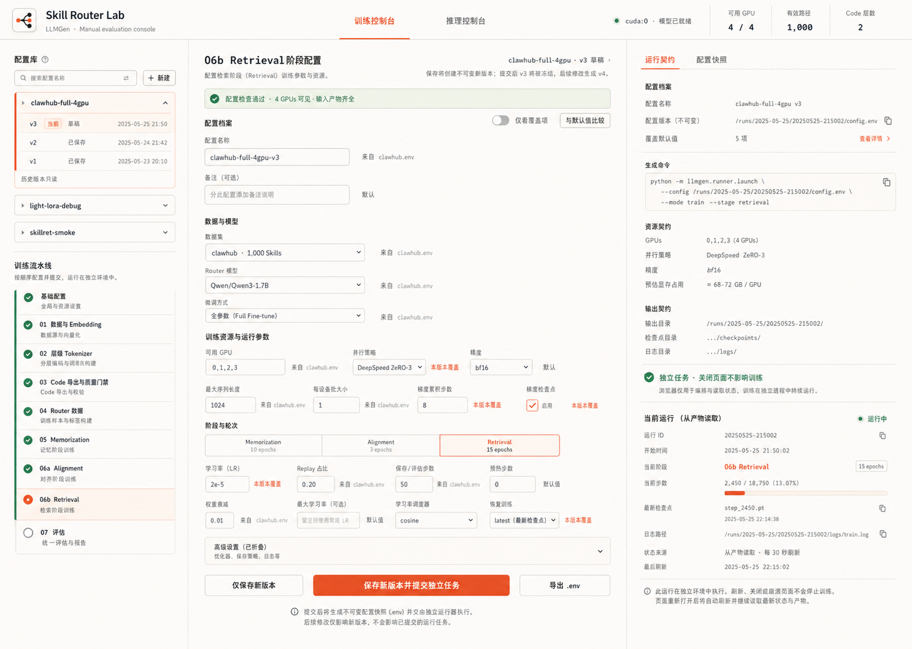
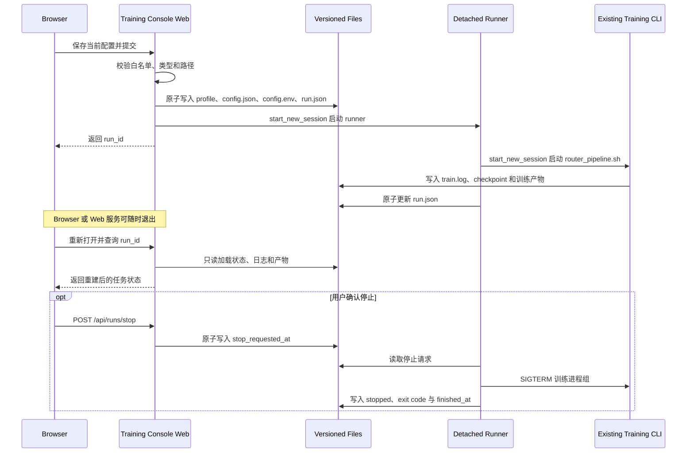

# LLMGen 训练控制台设计与实现规范

状态：已确认并完成首版实现；本文同时作为后续迭代的架构与交互基线。

视觉目标：



## 1. 背景

LLMGen 已提供完整的命令行训练、评估、导出流程，以及独立的推理 Web
界面。训练流程仍主要依赖环境变量和分阶段 Shell 脚本，开发者需要在多个配置文件、
终端和运行目录之间切换，较难快速确认“本次运行究竟使用了哪些参数”。

训练控制台用于：

1. 浏览和配置训练流程的全部关键参数；
2. 保存可追踪、可编辑的配置，并记录单调递增的 revision；
3. 在提交前显示最终生效值、来源、命令和产物路径；
4. 把配置快照提交给独立运行器；
5. 通过独立运行监控页观察元数据、流水线位置、GPU、日志和 checkpoint；
6. 通过磁盘停止请求让 detached runner 安全终止其自有训练进程组。

## 2. 强约束

### 2.1 与训练实现解耦

- 不修改 `scripts/router_pipeline.sh`、`scripts/skillret/*.sh`、
  `scripts/train_tokenizer.py`、`scripts/train_router.py` 或任何训练算法。
- 现有 CLI 是训练控制台与训练系统之间唯一的执行边界：

  ```text
  bash scripts/router_pipeline.sh <dataset> <command>
  ```

- 控制台不导入训练模块、不加载模型，也不复刻训练逻辑。
- 控制台保存的配置通过环境变量传给现有 CLI。
- 已保存 profile 可以原地更新；每次提交任务都会复制成不可变 run snapshot，
  后续编辑 profile 不能修改正在运行或历史任务。

### 2.2 训练生命周期独立

- 浏览器和 Web 服务都不是维持训练存活的生命周期所有者。
- Web 服务只启动一个新的、脱离当前会话的运行器进程。
- 独立运行器再以独立 session 启动现有训练 CLI，并把输出直接写入磁盘日志。
- 提交成功并返回 runner PID 后，Web 服务刷新、崩溃、被杀死或网络断开时，
  运行器和训练进程继续执行。
- 训练状态来自磁盘中的 `run.json`、日志和产物，不依赖浏览器连接或
  WebSocket 心跳。
- 停止控制采用协作协议：Web 服务只在 `run.json` 写入
  `stop_requested_at`，不向登记 PID 直接发送信号；拥有真实 `Popen` 对象的
  detached runner 负责向自己创建的训练进程组先发送 `SIGTERM`，宽限期后再按需
  发送 `SIGKILL`。
- 不提供暂停、恢复或任意 PID/命令控制；页面崩溃不会生成停止请求。

### 2.3 安全边界

- 数据集和 pipeline command 使用固定白名单。
- 参数名必须来自控制台 schema；值拒绝 NUL 和换行。
- 运行命令使用参数数组，禁止 `shell=True` 和拼接用户输入。
- `config.json` 冻结训练参数和非密钥运行环境，是运行器的权威输入；`.env`
  只用于审阅和导出，不会被 `source` 执行。
- runner 仅继承明确列出的系统/加速运行变量和密钥变量；`BASH_ENV`、
  `PYTHONPATH`、`LD_PRELOAD`、隐藏脚本路径和额外训练参数不会跨越边界。
- 即使环境变量命中 CUDA/NCCL/NVIDIA 等加速前缀白名单，名称中含 key、
  token、secret、password、credential 等敏感成分时也不会持久化。
- URL 配置使用结构化解析，拒绝 userinfo 和携带密钥、token、密码或签名的
  query 参数。
- API key 等密钥不写入配置版本或 API 响应。下游 stdout 原样写入的私有原始
  日志权限固定为 `0600`；浏览器日志 API 只从文件尾有界读取，并按已知值、
  代理 URL userinfo 和常见凭证模式脱敏。
- 所有请求的 HTTP Host 必须是 loopback；POST 只接受 `application/json`
  且要求 Origin 与 loopback Host 同源，阻断 DNS rebinding。
- 服务拒绝绑定非 loopback 地址；远程访问使用 SSH 隧道，或由带鉴权的反向代理
  转发到 loopback。反向代理必须把 Host 和 Origin 都重写为 loopback authority。

## 3. 现有训练流程映射

| UI 阶段 | CLI command | 现有实现 |
|---|---|---|
| 基础配置 | — | 数据集、运行目录、Python、设备 |
| 01 数据与 Embedding | `prepare` | `scripts/skillret/01_prepare.sh` |
| 02 层级 Tokenizer | `train-tokenizer` | `scripts/skillret/02_train_tokenizer.sh` |
| 03 Code 导出与质量门禁 | `export-codes` | `scripts/skillret/03_export_codes.sh` |
| 04 Router 数据 | `build-router-data` | `scripts/skillret/04_build_router_data.sh` |
| 05 Memorization | `train-memorization` | `scripts/skillret/05_train_memorization.sh` |
| 06a Alignment | `train-retrieval` 的第一阶段 | `scripts/skillret/06_train_retrieval.sh` |
| 06b Retrieval | `train-retrieval` 的第二阶段 | `scripts/skillret/06_train_retrieval.sh` |
| 07 评估 | `evaluate` | `scripts/skillret/07_evaluate.sh` |

完整运行使用 `full`。首版允许提交以下命令：

```text
full
prepare
train-tokenizer
export-codes
build-router-data
train-memorization
train-retrieval
evaluate
diagnose
diagnose-memorization
export-web
```

## 4. 页面信息架构

### 4.1 顶栏与页面切换

- 复用推理控制台的 Skill Router 标记、暖白背景和状态语言；
- 产品名为 `Skill Router Lab`；
- `配置工作台` 与 `运行监控` 是两个完整、可切换的控制台页面；
- `运行监控` 显示活跃任务数量，`推理控制台` 保持为独立入口；
- 顶部只展示训练控制台相关摘要：可见 GPU、当前配置、配置版本、Code 层数。

### 4.2 左侧：配置库与训练流水线

配置库：

- 搜索配置名；
- 新建配置；
- 展示多个配置族，例如：
  - `clawhub-full-4gpu`
  - `light-lora-debug`
  - `skillret-smoke`
- 每个配置族可以包含 `v1`、`v2`、`v3` 等稳定版本槽位；
- 每个版本槽位均可加载、编辑，并显示 `r1`、`r2` 等修订号；
- 保存时原子覆盖当前 `vN.json` 并递增 revision；
- 新建配置首次保存时创建 `v1 · r1`。

训练流水线：

- 展示第 3 节中的全部阶段；
- 点击阶段切换中心参数分组；
- 已满足输入依赖、当前阶段、未检查三种状态要可区分；
- 阶段状态仅用于配置导航，不代表控制台在编排训练代码。

### 4.3 中间：参数编辑

- 当前阶段标题和说明；
- 当前配置族、基于版本和草稿状态；
- 配置校验横幅；
- `仅看覆盖项`；
- `与默认值比较`；
- 字段旁显示来源：
  - `默认`
  - `configs/skillret.env`
  - `configs/closedset.env`
  - `configs/clawhub.env`
  - `configs/light.env`
  - `本版本覆盖`
- 修改字段后仅更新浏览器草稿；
- 高风险或低频字段放入“高级设置”，但仍可编辑；
- 所有输入具有 label、说明、错误反馈和键盘焦点状态。

### 4.4 右侧：运行契约与当前任务

`运行契约`：

- 配置名与版本；
- 覆盖默认值数量；
- 不可变运行快照路径；
- 生成命令；
- GPU、DeepSpeed、精度等资源摘要；
- 输出目录、checkpoint 和提交后分配的独立运行日志路径；
- 独立性声明：

  ```text
  独立任务 · 关闭页面不影响训练
  ```

`配置快照`：

- 只读显示最终生效 `.env`；
- 支持复制和下载；
- 不是可编辑代码编辑器。

`当前运行（从产物读取）`：

- run ID；
- profile/version；
- runner PID 和训练 PID；
- 当前阶段；
- 状态；
- 已解析进度文本；
- 最新 checkpoint；
- 日志路径；
- 最后更新时间；
- 提供进入完整“运行监控”页的入口。

### 4.5 运行监控页

- 左侧运行账本展示最近 100 条任务，可按全部、活跃、完成、异常筛选；
- 主区域展示选中任务的状态、profile revision、流水线位置和可解析进度；
- 运行遥测展示阶段、持续时间、runner/training PID、exit code、checkpoint
  与产物目录；
- GPU 面板通过独立的 `nvidia-smi` 只读探测展示利用率、显存和温度；
- 日志面板每 3 秒有界读取已脱敏的 `train.log` 尾部，支持跟随底部和手动刷新；
- 活跃任务提供显式二次确认的“停止训练”，停止中禁止重复提交；
- 配置页面右侧只保留当前任务摘要，不再承担完整监控职责。

### 4.6 主操作

1. `保存并提交独立任务`
2. `保存修改`
3. `导出 .env`

提交前必须：

- 所有字段通过类型和枚举校验；
- 数据集、命令和路径合法；
- GPU 数量与 `CUDA_VISIBLE_DEVICES` 一致；
- 控制台对可直接确认的本地依赖给出警告；数据质量门禁和阶段输入检查仍由
  现有 CLI 权威执行，并写入独立任务日志；
- 用户能看到最终命令和输出目录。

配置检查失败时，“提交任务”和“导出”保持禁用，但“保存配置”仍可点击并显示为
“重新检查并保存”。字段修正会立即清除旧错误状态并触发带请求序号的防抖校验；
过期响应不得覆盖较新的校验结果。无效配置始终不会落盘。

## 5. 参数 schema

控制台 schema 是展示和校验元数据，不是训练逻辑。权威默认值仍来自现有配置链：

```text
configs/<dataset>.env
  -> configs/closedset.env
  -> configs/skillret.env
```

解析时强制把 `SKILLRET_ROOT` 锚定到当前 `repo_root`，并以 `set -e` 传播嵌套
`source` 失败；外部旧 clone 路径、`BASH_ENV` 和未登记变量不会影响 schema。

### 5.1 基础配置

| 参数 | 类型 | 说明 |
|---|---|---|
| `DATASET` | enum | `clawhub` 或 `light` |
| `PIPELINE_COMMAND` | enum | 第 3 节中的 command |
| `RUN_DIR` | path | 本次训练运行目录 |
| `PYTHON` | path | Python 可执行文件 |
| `DEVICE` | string | 默认 `cuda` |
| `CUDA_VISIBLE_DEVICES` | csv | 例如 `0,1,2,3` |
| `SKIP_PREPARE` | bool | 完整流程是否跳过已有预处理 |

`RUN_DIR` 是训练产物的单一工作目录根：

| 派生参数 | 默认值 |
|---|---|
| `PROCESSED_DIR` | `$RUN_DIR/processed` |
| `EMBEDDING_DIR` | `$RUN_DIR/embeddings` |
| `STAGE1_DIR` | `$RUN_DIR/stage1` |
| `INDEX_DIR` | `$RUN_DIR/index` |
| `ROUTER_DATA_DIR` | `$RUN_DIR/router_data` |
| `ROUTER_OUTPUT_DIR` | `$RUN_DIR/router` |
| `EVAL_DIR` | `$RUN_DIR/evaluation` |

未覆盖字段的输入框直接显示上述 `$RUN_DIR/xxx` 表达式；后端只对这组白名单表达式
做安全展开，并在运行契约与快照中呈现实际路径。修改 `RUN_DIR` 不改写派生字段，
也不清除用户对单个目录的独立覆盖；`$RUN_DIR/custom_path` 形式的单项覆盖同样
由后端安全展开，不执行通用 shell 插值。`DATASET_DIR` 是原始数据源位置，训练
控制台 state root 是独立控制面状态，两者都不随 `RUN_DIR` 变化。

### 5.2 数据与 Embedding

```text
DATASET_DIR
PROCESSED_DIR
EMBEDDING_DIR
EMBEDDING_PROVIDER
EMBEDDING_MODEL
EMBEDDING_BASE_URL
EMBEDDING_BATCH_SIZE
EMBEDDING_DIMENSIONS
EMBEDDING_TIMEOUT
EMBEDDING_MAX_RETRIES
EMBEDDING_MAX_BATCH_CHARS
EMBEDDING_MAX_SKILL_CHARS
```

`OPENAI_API_KEY` 不进入 schema 的可持久化值；界面只显示“由运行环境提供”。

### 5.3 层级 Tokenizer

```text
STAGE1_DIR
NUM_LEVELS
BRANCHING_FACTORS
SK_EPSILONS
RQ_LAYERS
TOKENIZER_E_DIM
TOKENIZER_BETA
TOKENIZER_EPOCHS
TOKENIZER_BATCH_SIZE
TOKENIZER_LR
TOKENIZER_SCHEDULER
TOKENIZER_WARMUP_RATIO
TOKENIZER_EVAL_EVERY
TOKENIZER_GRAPH_LAMBDA
TOKENIZER_AMP_DTYPE
TOKENIZER_RESUME
CODEBOOK_VERSION
CODE_QUALITY_GATE_SPLIT
CODE_MAX_COLLISION_RATE
CODE_MAX_RAW_COLLISION_RATE
CODE_MAX_BUCKET_SIZE
CODE_MIN_LEVEL_UTILIZATION
CODE_MIN_NORMALIZED_ENTROPY
CODE_MIN_RAW_LEVEL_UTILIZATION
CODE_MIN_RAW_NORMALIZED_ENTROPY
```

质量门参数的权威执行点仍是 Stage 03，但同时显示在 Stage 02，便于在设计层级
Code 时一次完成配置。ratio 和 ratio list 均限制在 `0..1`。

### 5.4 Code 导出与质量门禁

```text
INDEX_DIR
CODE_SPLITS
CODE_EXPORT_BATCH_SIZE
CODE_ASSIGNMENT_MODE
CODE_ASSIGNMENT_EXACT_GROUP_SIZE
CODE_QUALITY_GATE_SPLIT
CODE_MAX_COLLISION_RATE
CODE_MAX_RAW_COLLISION_RATE
CODE_MAX_BUCKET_SIZE
CODE_MIN_LEVEL_UTILIZATION
CODE_MIN_NORMALIZED_ENTROPY
CODE_MIN_RAW_LEVEL_UTILIZATION
CODE_MIN_RAW_NORMALIZED_ENTROPY
```

质量门禁字段必须保持显式；控制台不得自动放宽阈值。

### 5.5 Router 数据

```text
ROUTER_DATA_DIR
MEMORIZATION_VALIDATION_FRACTION
ROUTER_VALIDATION_FRACTION
ROUTER_DATA_SEED
```

### 5.6 Router 通用和分布式训练

```text
ROUTER_OUTPUT_DIR
ROUTER_MODEL
ROUTER_FINETUNE_MODE
ROUTER_NUM_GPUS
ROUTER_DEEPSPEED_CONFIG
ROUTER_PER_DEVICE_TRAIN_BATCH_SIZE
ROUTER_PER_DEVICE_EVAL_BATCH_SIZE
ROUTER_GRADIENT_ACCUMULATION_STEPS
ROUTER_MAX_LENGTH
ROUTER_WEIGHT_DECAY
ROUTER_WARMUP_RATIO
ROUTER_LOGGING_STEPS
ROUTER_SAVE_STEPS
ROUTER_EVAL_STEPS
ROUTER_SAVE_TOTAL_LIMIT
ROUTER_DATALOADER_NUM_WORKERS
ROUTER_SEED
ROUTER_PRECISION
ROUTER_GRADIENT_CHECKPOINTING
ROUTER_GRADIENT_CHECKPOINTING_MODE
ROUTER_TRUST_REMOTE_CODE
```

LoRA 条件字段：

```text
ROUTER_LORA_R
ROUTER_LORA_ALPHA
ROUTER_LORA_DROPOUT
ROUTER_LORA_TARGET_MODULES
ROUTER_LORA_MODULES_TO_SAVE
```

### 5.7 阶段超参数与恢复

```text
ROUTER_MEMORIZATION_EPOCHS
ROUTER_MEMORIZATION_LR
ROUTER_RESUME_MEMORIZATION
ROUTER_ALIGNMENT_EPOCHS
ROUTER_ALIGNMENT_LR
ROUTER_RESUME_ALIGNMENT
ROUTER_RETRIEVAL_EPOCHS
ROUTER_RETRIEVAL_LR
ROUTER_RETRIEVAL_REPLAY_FRACTION
ROUTER_RESUME_RETRIEVAL
```

### 5.8 评估

```text
EVAL_PROTOCOL
QUERY_SET
EVAL_DTYPE
EVAL_BATCH_SIZE
EVAL_MAX_CODE_PATHS
EVAL_TOP_K
EVAL_CUTOFFS
EVAL_DIR
```

## 6. 配置持久化模型

运行时状态根目录默认为：

```text
.llmgen/training-console/
```

可通过 `LLMGEN_TRAINING_CONSOLE_STATE` 覆盖。

浏览器中的字段修改只存在于内存草稿中。点击保存后：

1. 浏览器向 `POST /api/profiles` 发送 `profile_id`、`version`、
   `expected_revision` 和 overrides；
2. Web 服务重新解析仓库默认配置并执行完整校验；
3. `StateStore` 在 `.registry.lock` 文件锁内核对 revision；
4. 内容先写入同目录的 `0600` 临时文件并 `fsync`；
5. `os.replace` 原子替换目标 `vNNNN.json`。

因此 Web 进程崩溃不会留下半个 JSON；但没有点击保存的浏览器草稿不会落盘。

目录结构：

```text
.llmgen/training-console/
├── profiles/
│   └── clawhub-full-4gpu/
│       ├── v0001.json
│       ├── v0002.json
│       └── v0003.json
└── runs/
    └── run_20260727_153012_ab12cd/
        ├── config.json
        ├── config.env
        ├── run.json
        ├── runner.log
        └── train.log
```

可编辑配置 JSON：

```json
{
  "schema_version": 2,
  "profile_id": "clawhub-full-4gpu",
  "version": 1,
  "revision": 4,
  "dataset": "clawhub",
  "command": "full",
  "parent_version": null,
  "name": "clawhub-full-4gpu",
  "notes": "",
  "created_at": "ISO-8601 UTC",
  "updated_at": "ISO-8601 UTC",
  "overrides": {
    "ROUTER_NUM_GPUS": "4",
    "ROUTER_FINETUNE_MODE": "full"
  },
  "resolved": {
    "ROUTER_NUM_GPUS": "4",
    "ROUTER_FINETUNE_MODE": "full"
  }
}
```

规则：

- `version` 是稳定文件槽位，保存修改不改变 `vN`；
- `revision` 每次保存递增；客户端提交 `expected_revision` 做乐观并发检查；
- 首次保存新配置时创建 `v1 · r1`；
- JSON 在文件锁内使用临时文件加原子 rename，读取方不会看到半写文件；
- profile ID 只能包含小写字母、数字、短横线和下划线；
- `overrides` 只保存相对默认值有变化的字段；
- `resolved` 保存本次修订的完整最终值；
- 真正保证训练可复现的是提交时复制到 run 目录、之后不再修改的
  `config.json`。

## 7. 运行快照与状态模型

运行状态：

```text
queued -> starting -> running -> succeeded
           |            |      -> failed
           |            `------> stopping -> stopped
           |            `------> unknown（只读观察状态）
           `-> failed_to_start
queued -> saved（仅 --no-launch）
```

`unknown` 是读取时发现已登记的 runner 与训练 PID 均不存在时返回的观察状态，
不会触发自动重启。

`config.json` 在提交时额外冻结非密钥运行环境：

```json
{
  "resolved": {
    "ROUTER_NUM_GPUS": "4"
  },
  "runtime_env": {
    "PATH": "...",
    "NCCL_DEBUG": "INFO"
  }
}
```

`runtime_env` 只包含显式允许、非密钥的系统/加速运行变量；训练参数仍来自
`resolved`，密钥只在进程启动时从显式 secret 白名单注入。

`run.json` 至少包含：

```json
{
  "schema_version": 1,
  "run_id": "run_20260727_153012_ab12cd",
  "profile_id": "clawhub-full-4gpu",
  "profile_version": 3,
  "dataset": "clawhub",
  "command": "full",
  "status": "running",
  "stage": "06b Retrieval",
  "runner_pid": 12345,
  "training_pid": 12367,
  "created_at": "ISO-8601 UTC",
  "started_at": "ISO-8601 UTC",
  "finished_at": null,
  "updated_at": "ISO-8601 UTC",
  "exit_code": null,
  "latest_checkpoint": "runs/.../checkpoint-500",
  "progress_text": "step 2450 / 18750",
  "stop_requested_at": null,
  "stop_requested_stage": "",
  "command_argv": [
    "bash",
    "scripts/router_pipeline.sh",
    "clawhub",
    "full"
  ],
  "config_path": ".../config.json",
  "env_path": ".../config.env",
  "log_path": ".../train.log"
}
```

Runner 每隔数秒：

- 检查训练进程；
- 读取新增日志；
- 从 `[01]`、`[02]`、`[06a]`、`[06b]` 等标记更新阶段；
- 解析最新的 `checkpoint-*` 字样；
- 检查 `stop_requested_at`；收到请求后只终止自己创建的训练进程组；
- 原子更新 `run.json`；
- 进程结束后写入 exit code 和最终状态。

若 Web 服务发现状态为 running，但 runner 和训练 PID 均不存在，则只读返回
`unknown`，不尝试重启或修改训练。

## 8. 独立运行协议



## 9. HTTP API

### 9.1 读取

```text
GET /api/health
GET /api/schema?dataset=clawhub
GET /api/profiles
GET /api/profile?id=<profile_id>&version=<n>
GET /api/runs?limit=20
GET /api/run?id=<run_id>
GET /api/run-log?id=<run_id>&tail=200
```

### 9.2 写入

```text
POST /api/profiles
POST /api/validate
POST /api/runs
POST /api/runs/stop
```

`POST /api/profiles` 未提供 `version` 时创建新配置的 `v1 · r1`；提供
`version + expected_revision` 时原地更新该版本并递增 revision。revision 不匹配时
拒绝保存，避免两个浏览器页面静默互相覆盖。

```json
{
  "profile_id": "clawhub-full-4gpu",
  "dataset": "clawhub",
  "command": "full",
  "version": 1,
  "expected_revision": 3,
  "overrides": {
    "ROUTER_RETRIEVAL_EPOCHS": "5"
  }
}
```

`POST /api/runs` 只接受已保存的 `profile_id + version`。服务重新加载该版本，
把当前 revision 复制为独立且不可变的 run snapshot 后再启动任务，避免提交浏览器
中未保存的草稿，也避免后续配置修改影响任务。

`POST /api/runs/stop` 只接受已登记且仍活跃的 `run_id`。它只持久化协作停止
请求，不接受 PID、signal 或命令；终止信号只能由对应 detached runner 发给它
自己创建的训练进程组。

API 响应不返回已知密钥，不返回任意文件内容，不允许客户端传入任意命令。
所有请求必须携带 loopback Host；写请求还必须为同源 `application/json`。

## 10. 错误与恢复体验

| 场景 | 行为 |
|---|---|
| Web 服务在 runner 成功启动后崩溃 | 训练继续；重启后从磁盘恢复配置和运行列表 |
| 浏览器关闭或刷新 | 训练继续；页面重新查询任务 |
| Runner 启动失败 | run 状态为 `failed_to_start`，不启动训练 |
| Runner 意外退出、训练仍在 | UI 根据 training PID 显示 `running` 或 `unknown` |
| 训练返回非零状态 | run 状态为 `failed` 并显示 exit code 和日志尾部 |
| 配置修订冲突 | 拒绝覆盖并提示重新加载最新 revision |
| 质量门禁失败 | 保留失败状态和日志，不自动修改阈值重试 |
| 用户停止活跃任务 | `running -> stopping -> stopped`；保留日志、快照和 checkpoint |
| 停止请求到达时进程已退出 | 记录为 `stopped`，不向可能复用的 PID 发送信号 |
| 输入产物缺失 | 现有 CLI 失败并记录具体文件或阶段；控制台只读呈现状态与日志 |
| UI 无法读取某个 run | 其他任务仍可读取，错误局部展示 |

## 11. 视觉与交互规范

- 目标桌面视口：`1440 × 1024`；
- 基础色延续推理控制台：
  - warm ivory 背景；
  - near-black 主文字；
  - coral/vermilion 主操作和当前状态；
  - green 表示校验通过或独立任务运行；
  - warm-gray 分隔线；
- 配置页使用平面分区和细分隔线；监控页采用工业观测台式运行账本与遥测面板；
- 正文基准为 14–16px，路径与参数使用 monospace；
- 主要交互都必须有 hover、focus-visible、disabled、loading、success、error 状态；
- 表单错误与字段关联，不只依赖颜色；
- 桌面三栏保持与视觉稿一致；
- 小于等于 1320px 时，右侧运行契约下移，避免三栏最小宽度造成裁切；
- 小于等于 780px 时，配置库、阶段导航、表单、运行契约按顺序纵向排列；
- 仅使用进度条和 GPU meter 表达真实遥测；动画限于刷新状态和不确定进度，并
  遵循 `prefers-reduced-motion`。

## 12. 验收标准

### 12.1 功能

- 能加载 `clawhub` 和 `light` 的有效默认值；
- 能创建多个配置族；
- 能加载并原地修改任一已保存版本；
- 每次保存递增 revision，过期页面不能覆盖较新修订；
- 能按阶段编辑所有 schema 字段；
- 能比较默认值和覆盖值；
- 能导出 `.env`；
- 能从已保存版本提交白名单 pipeline command；
- 已提交任务的配置快照不受后续 profile 修改影响；
- 能在 Web 服务重启后恢复 profile 和 run 列表；
- 能有界读取任务日志尾部、阶段、PID、exit code 和最新 checkpoint；
- 能在完整监控页切换历史任务，显示 GPU、流水线位置与持续时间；
- 能对活跃任务二次确认并发出协作停止请求；
- Stage 02 能直接配置 raw collision rate 等全部 Code 质量门参数；
- 不修改任何训练脚本。

### 12.2 独立性

- 提交一个测试任务后终止 Web 服务，测试任务仍能完成；
- runner 和训练进程均使用独立 session；
- 日志直接写文件，不依赖 Web 服务转发；
- 正在运行的配置快照不可编辑；
- UI 停止操作只写入显式、可审计的停止请求，由 runner 终止其自有进程组。

### 12.3 安全

- 任意 command、环境变量名、profile ID 和换行注入被拒绝；
- 不持久化或返回 API key；
- 非密钥运行环境随 run snapshot 冻结，行为注入变量不会被继承；
- 原始日志为 `0600`；日志 API 最多读取 1 MiB、限制单行长度，并对已知密钥、
  代理 URL userinfo 和常见凭证模式脱敏；
- 所有请求校验 loopback Host；POST 强制 JSON 并校验同源 Origin；
- 静态文件不能越过指定目录；
- 日志 API 只能读取已登记 run 的日志；
- 只允许绑定 loopback。

### 12.4 设计 QA

- 在 `1440 × 1024` 下与选定设计的布局、层级、颜色、间距和密度一致；
- 左侧同时容纳配置库和完整流水线；
- 配置工作台以中间表单为视觉主体；运行监控页以状态、进度和日志为主体；
- 右侧清晰区分可编辑 profile、不可变 run snapshot 和独立运行语义；
- 页面无横向溢出、裁切或不可读小字；
- 配置切换、版本加载、阶段导航、过滤覆盖项、比较默认值、保存、提交和
  运行观察均可操作；
- `design-qa.md` 最终状态为 `passed`。

## 13. 首版实现文件边界

新增：

```text
training_console/
├── __init__.py
├── config.py
├── runner.py
├── server.py
├── store.py
├── README.md
└── static/
    ├── app.js
    ├── index.html
    ├── skill-router-mark.svg
    └── styles.css
scripts/serve_training_console.sh
tests/test_training_console.py
```

允许更新：

```text
.gitignore
design-qa.md
README.md
pyproject.toml
```

明确不修改：

```text
scripts/router_pipeline.sh
scripts/skillret/*
scripts/train_tokenizer.py
scripts/train_router.py
src/llmgen/*
web_server/*
```
